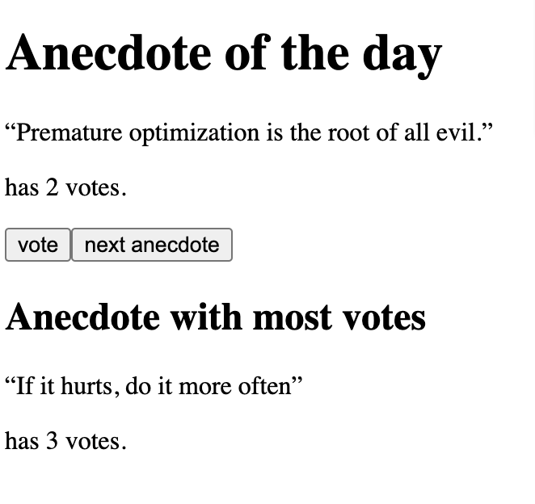

# FullStack Open

This **anecdotes app** was created to meet the requirements of [1.12-1.14 FullStackOpen](https://fullstackopen.com/en/part1/a_more_complex_state_debugging_react_apps#exercises-1-6-1-14).

It is a simple React.js app to randomly display a quote in response to a button click, with a voting mechanism for best quote, and display of the most popular quote.

  
   

