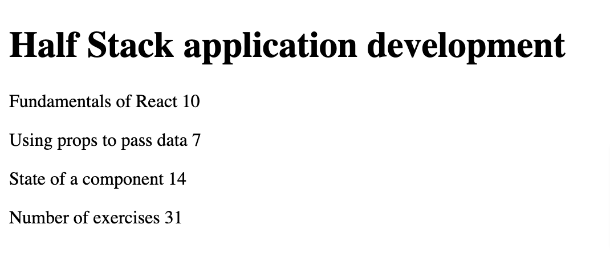

# FullStack Open

This **courseinfo app** was created to meet the requirements of [1.1-1.2](https://fullstackopen.com/en/part1/introduction_to_react#exercises-1-1-1-2) and [1.3-1.5](https://fullstackopen.com/en/part1/java_script#exercises-1-3-1-5) of FullStackOpen.

This is a very basic React.js app to display data.

  
