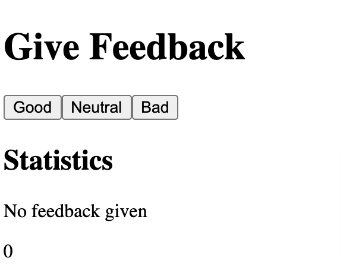
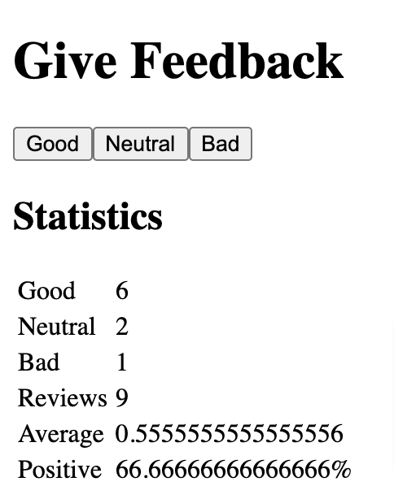

# Unicafe App [FullStack Open]

This **unicafe app** was created to meet the requirements of [1.6-1.12 FullStackOpen](https://fullstackopen.com/en/part1/a_more_complex_state_debugging_react_apps#exercises-1-6-1-14).

It is a simple React.js app that allows a user to give feedback by pressing a button (good, bad, neutral) with statistics displayed.

<kbd style="display:inline-block; width:250px; hspace: 20px; vertical-align: top;"  >
  </kbd>
  <kbd style="display:inline-block; width:250px; hspace: 20px; vertical-align: top;"  >
   </kbd>

## Technologies used

- React.js functional components are used.
- This project was bootstrapped with [Create React App](https://github.com/facebook/create-react-app).

## How to run the app

In the project directory, ensure npm is installed, and then run:
`npm start`

Open [http://localhost:3000](http://localhost:3000) to view it in the browser.
