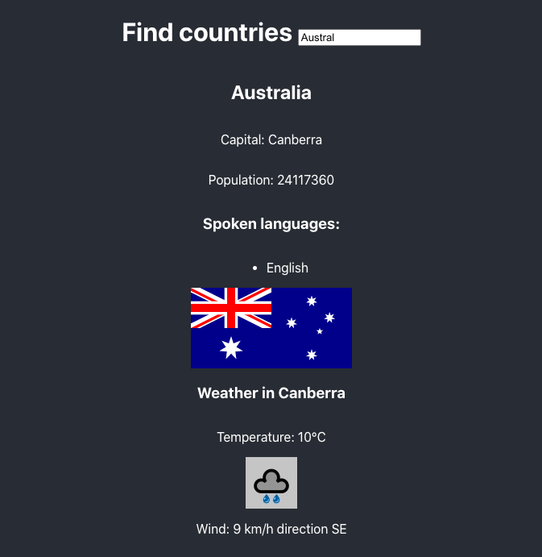
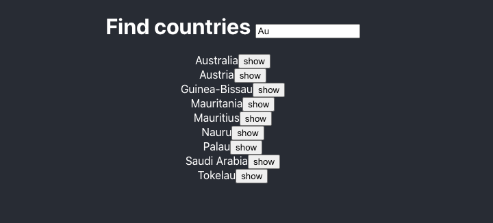
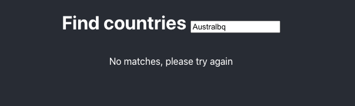
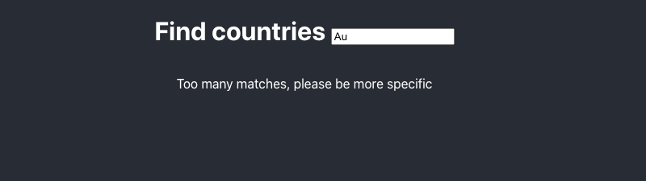

# Countries Data & Weather App [FullStack Open]

This **countries app** was created to meet the requirements of [2.12-2.14](https://fullstackopen.com/en/part2/getting_data_from_server#exercises-2-11-2-14) of [FullStackOpen](https://fullstackopen.com/en/).

This is a simple React.js app that allows a user to:

- Find a country by search input. A maximum of ten countries will be displayed at a time.
- Further instruction provided if there are no results, or too many results.
- View country data (capital, population, spoken languages).
- View the current weather in the country's capital.

<kbd style="display:inline-block; width:250px; hspace: 20px; vertical-align: top;"  >
  
  </kbd>
  <kbd style="display:inline-block; width:250px; hspace: 20px; verrtical-align: top;"  >
  
  
  
  </kbd>

## Technologies used

- The [restcountries](https://restcountries.eu) API is used to gain country data.
- The [weatherstack](https://weatherstack.com/) API is used to gain weather data.
- Axios is a dependency to manage promises when getting data from the APIs.
- This project was bootstrapped with [Create React App](https://github.com/facebook/create-react-app).
- React.js functional components and hooks are used.

## How to run the app

In the project directory, ensure npm is installed, and then run:
`npm start`

Open [http://localhost:3000](http://localhost:3000) to view it in the browser.
