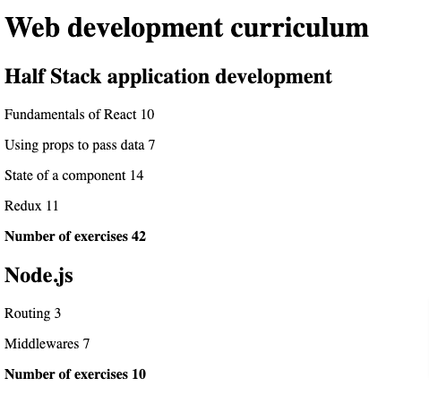

# CourseInfo Part 2 [FullStack Open]

This **courseinfo app** was created to meet the requirements of [2.1-2.5](https://fullstackopen.com/en/part2/rendering_a_collection_modules#exercises-2-1-2-5) of [FullStackOpen](https://fullstackopen.com/en/).

This is a very basic React.js app to display data. Any number of courses can be displayed (drawn from mock data).

<kbd style="display:inline-block; width:250px; hspace: 20px; vertical-align: top;"  >
  </kbd>

## Technologies used

- React.js functional components are used.
- This project was bootstrapped with [Create React App](https://github.com/facebook/create-react-app).

## How to run the app

In the project directory, ensure npm is installed, and then run:
`npm start`

Open [http://localhost:3000](http://localhost:3000) to view the app in the browser.
