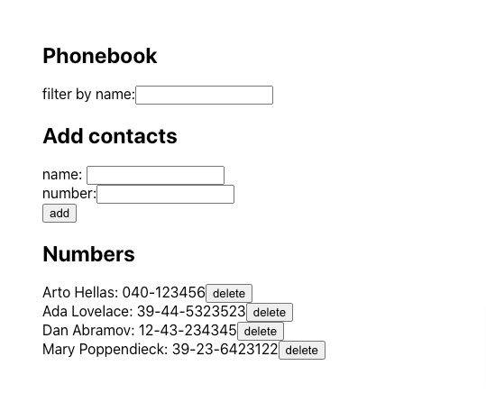
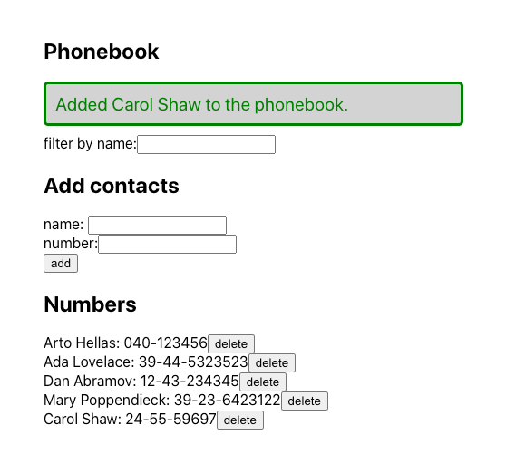
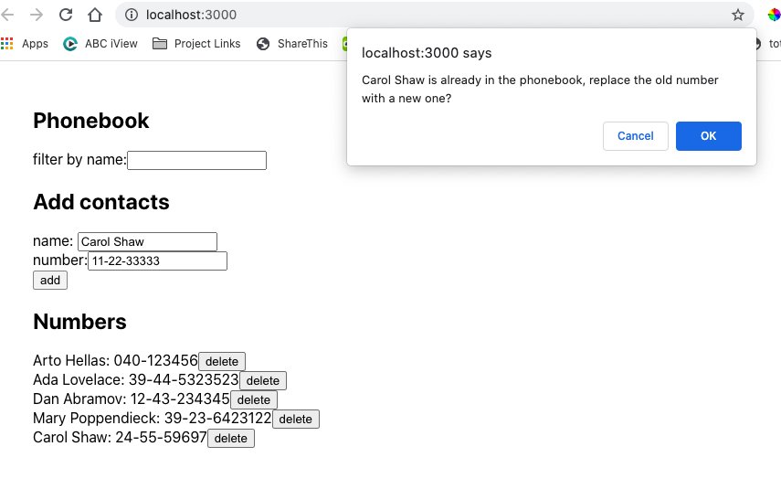
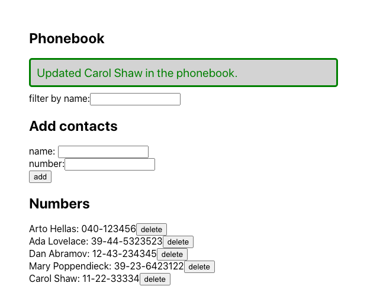
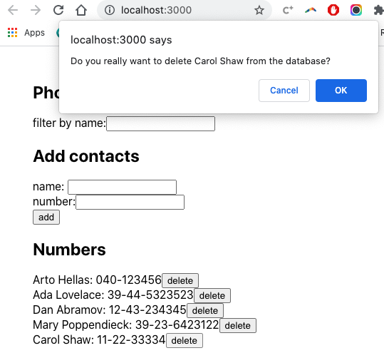
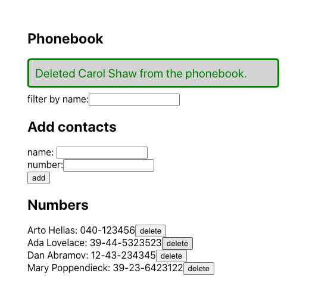
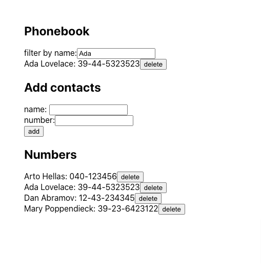

# Phonebook App [FullStack Open]

This **phonebook app** was created to meet the requirements of [FullStackOpen](https://fullstackopen.com/en/):
- [2.6-2.10](https://fullstackopen.com/en/part2/forms#exercises-2-6-2-10)
- [2.11](https://fullstackopen.com/en/part2/getting_data_from_server#exercises-2-11-2-14)
- [2.15-2.18](https://fullstackopen.com/en/part2/altering_data_in_server#exercises-2-15-2-18)
- [2.19-2.20](https://fullstackopen.com/en/part2/adding_styles_to_react_app#exercises-2-19-2-20)

This is a simple CRUD React.js app that allows a user to:

- Create a contact by adding a name and phone number to the database 
- View existing contacts in the database
- Search for existing contacts
- Delete a contact, after confirmation.
- If an existing contact is "added" with a new number, the contact's number is updated in the database (after confirmation).
- Notification messages on success or failure of an action. 

<kbd style="display:inline-block; width:120px; hspace: 20px; vertical-align: top;"  >
  
   
  
  
  </kbd>
  <kbd style="display:inline-block; width:120px; hspace: 20px; vertical-align: top;"  >
   
    
    
  </kbd>

## Technologies used

- json-server is used to manage data.
- Axios is a dependency to manage promises when handling data with the database.
- This project was bootstrapped with [Create React App](https://github.com/facebook/create-react-app).
- React.js functional components and hooks are used.

## How to run the app

In the project directory, ensure npm is installed, and then run:
`npm run server`

In a second terminal, in the project directory, run:
`npm start`

Open [http://localhost:3000](http://localhost:3000) to view it in the browser.
